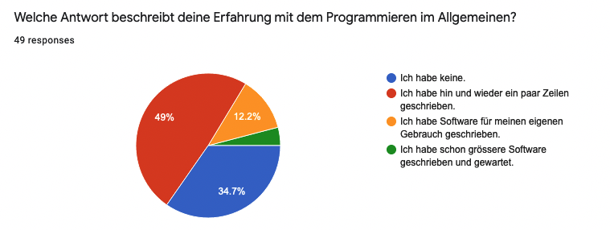
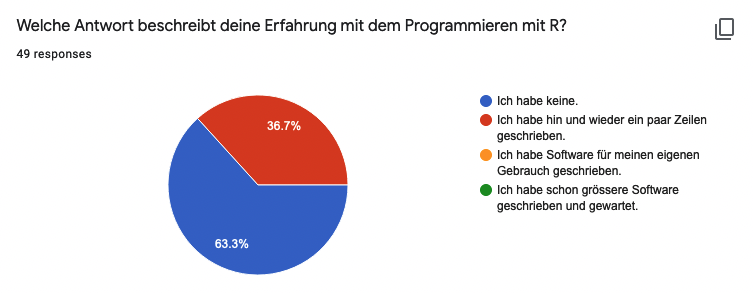
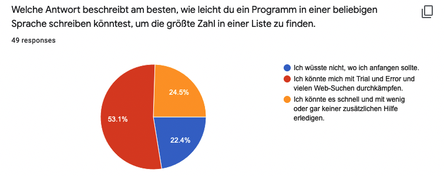
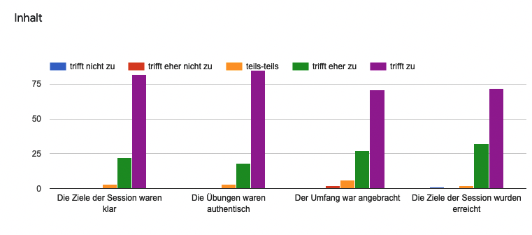

```{r setup, include=FALSE}
options(
  htmltools.dir.version = FALSE,   
  htmltools.preserve.raw = FALSE # to fix HTML issue
  )
# figure height, width, dpi
knitr::opts_chunk$set(echo = FALSE, 
                      warning = FALSE, 
                      eval = TRUE,
                      fig.width = 6, 
                      fig.asp = 0.5,
                      comment = "", 
                      cache = FALSE, 
                      out.width = "100%",
                      fig.align = "center",
                      dpi = 300,
                      message = FALSE)

# ggplot2 set theme
ggplot2::theme_set(ggplot2::theme_gray(base_size = 16))

library(tidyverse)
library(xaringanExtra)
xaringanExtra::use_panelset()
xaringanExtra::use_share_again()
xaringanExtra::style_share_again(
  share_buttons = c("twitter", "linkedin", "pocket")
)

# load packages -----------------------------------------------------------

library(xaringanthemer)
library(palmerpenguins)

# set options -------------------------------------------------------------

style_mono_accent(
  base_color = "#0F4C81", # Pantone Classic Blue
  header_font_google = google_font("Montserrat"),
  code_font_google = google_font("Fira Mono"), 
  code_highlight_color = "#D3D3D3", code_inline_background_color = "#D3D3D3", 
  code_font_size = "1.2rem",
  text_font_size = "1.4rem", 
  header_h1_font_size = "2.0rem",
  header_h2_font_size = "1.75rem",
  header_h3_font_size = "1.5rem",
  footnote_font_size = "0.8rem",
  footnote_position_bottom = "20px",
  header_background_padding = "2rem",
  outfile = here::here("slides/assets/css/xaringan-themer.css")
)

# htmttools

library(htmltools)

```

```{r broadcast, echo=FALSE}
xaringanExtra::use_broadcast()
```


class: title-slide


# `r rmarkdown::metadata$title`

## `r rmarkdown::metadata$subtitle`

.bottom[

```{r, echo=FALSE}
p(rmarkdown::metadata$author)
p(rmarkdown::metadata$date)
```
]


---
layout: true

---
class: middle, inverse

# .large[Warum?]

---
## Warum? (Bisher nur Outline)

**STAT**

- Kompetenzen im Umgang mit R und git/GitHub ausbauen um Kollaboration effizienter zu machen
- Analytische Kompetenzen ausbauen um bessere datenbasierte Entscheidungen zu treffen 
- Verständnis von strukturierten öffentlichen Daten (OGD) erhöhen um Anzahl der Publikationen voranzutreiben 

**Kursteilnehmer_innen**

- Weg von Excel, SPSS und STAT -> Hin zu modernen Open Source Alternativen
- Datenvisualisierungen
- Effizienteres Arbeiten und Zugang zum Programmieren bekommen
    
---
class: middle, inverse

# .large[Was?]

---
class: left
background-image: url(img/starwars-rey-rstats.png)
background-position: middle
background-size: contain


.footnote[Artwork from [@juliesquid](https://twitter.com/juliesquid) for [@openscapes](https://twitter.com/openscapes) (illustrated by [@allison_horst](https://twitter.com/allison_horst)).]


???

- Ein neuartiger Kurs, welcher es sich zum Ziel setzt Analytiker in der Verwaltung mit modernen Werkzeugen für die Arbeit mit Daten auszustatten

- Der Kurs wurde für Beginner konzipiert und Bedarf keinerlei Vorkenntnisse

- Ein Fokus wird auf Kollaboratives Arbeiten und das Kommunizieren von Datenprojekten gelegt, wesshalb wir von Beginn an Git und GitHub nutzen und im R Markdown Format schreiben


---
# Was? - Lernziele

Am Ende des Kurses können Teilnehmer_innen

1. (Daten)projekte reproduzierbar publizieren
2. Kollaborativ mit Git und GitHub arbeiten
3. Das Konzept von Tidy Data verstehen und anwenden
4. Explorative Datenanalysen durchführen
5. Sich selbst und Anderen helfen mehr über die grosse Welt der Möglichkeiten für Data Science mit R zu lernen


---
class: middle, inverse

# .large[Wie?]

---
## Wie? - Werkzeugkiste

.pull-left[

### **Kursarbeit**

- Zoom
- Slack
- https://rstatszh.github.io/website/
]

.pull-right[

### Data Science

**Programmieren**

- R
- RStudio (Cloud)
- R Tidyverse Packages
- R Markdown

**Versionskontrolle und Kollaboration**

- Git
- GitHub

]

---
## Wie? - Kursüberblick (vielleicht weglassen)

Sieben Kurseinheiten über sieben Wochen

- **Unterricht:** Wöchentlich 3 Stunden
- **Übungen:** Übungen während der Kurseinheit 
- **Hausaufgaben:** Einzureichen bis zum nächsten Kurstag 
- **Persönliches Tutoring:** Sprechstunden ausserhalb der Kurstage
- **Abschluss Projekt (freiwillig):** 
    - Eigene Arbeitsatmosphäre aufbauen
    - Arbeit mit eigenen Daten 
    - Bericht erfassen
    - 5 Minuten Präsentation
- **Zertifikat:** Bestätigung über Teilnahme


---
class: middle, inverse

# .large[Wer?]

---

```{r}



```

---

```{r}



```

---

```{r}



```

---
# Text Analyse auf Frage:

"Was möchtest du nach diesem Kurs wissen oder machen können, dass du momentan nicht weisst oder nicht machen kannst?"

- Was sind die Top 5 Begriffe die gennant werden?
- Welche zwei Worte werden am häufigsten zusammen gennannt?


---
class: middle, inverse

# .large[Wieviel?]

---
## Wieviel wurde programmiert?

Ich habe Nutzungsdaten aus der RStudio Cloud, aber momentan nur als Dashboard. Versuche an die Rohdaten zu kommen und folgende Indikatoren zu zeigen:

- Anzahl Stunden pro Teilnehmer_in und (mean, sd) welche zusätzlich zu den 3 Kurstunden pro Woche aufgewendet wurden 
- Zeitreihe der Summe Stunden pro Woche über alle Kurse

Falls ich nicht an Daten komme, dann berechne ich ein paar Kennzahlen selbst. 

---
class: middle, inverse

# .large[Evaluation / Zufriedenheit]


---
## Evaluation - wöchentlich

- Zeige Ergebnis einer Frage zum Inhalt der Kurseinheit
- **Plot wird mit R reproduziert**

```{r}



```

---
# `r emo::ji("sunflower")` Danke 

Für die Aufmerksamkeit!

Für die R packages [{xaringan}](https://github.com/yihui/xaringan) und [{xaringanthemer}](https://github.com/gadenbuie/xaringanthemer) 

**Folien als PDF**:

**Folien als HTML**:

**Kurswebseite**: https://rstatszh.github.io/website/posts/2021-02-17-ueberblick/

**Email**: Lars@Lse.de

**Twitter**: @larnsce


